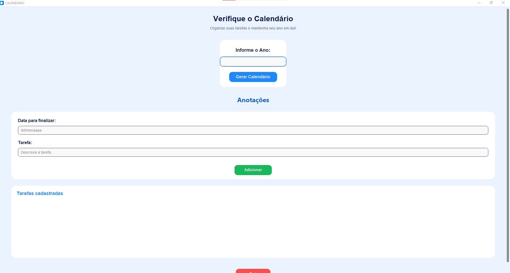

# 📅 Agenda de Tarefas em Python

Aplicação de agenda desenvolvida em **Python** durante meus estudos de programação.

O projeto foi criado com o objetivo de praticar conceitos de programação e desenvolvimento de interfaces gráficas, transformando conhecimentos teóricos em uma aplicação funcional.

## 🖥️ Sobre o projeto

## 📸 Demonstração

A Agenda permite organizar tarefas por meio de uma interface gráfica e possui recursos relacionados à visualização e organização de atividades.

Este projeto faz parte da minha jornada de aprendizado em programação e foi desenvolvido com foco na prática de conceitos fundamentais de Python.

## ⚙️ Funcionalidades

* 📝 Gerenciamento de tarefas
* 📅 Visualização de calendário
* 🖥️ Interface gráfica
* ⚠️ Validação de informações
* 🔧 Tratamento de erros
* 📚 Organização do código em funções

## 🛠️ Tecnologias utilizadas

* **Python**
* **CustomTkinter**
* **Tkinter**
* **Calendar**

## 📚 Conceitos praticados

Durante o desenvolvimento foram praticados conceitos como:

* Variáveis
* Listas
* Funções
* Estruturas condicionais
* Tratamento de exceções
* Manipulação de interfaces gráficas
* Bibliotecas e módulos
* Organização de código

## 🚀 Objetivo

O objetivo principal deste projeto foi desenvolver uma aplicação prática enquanto aprimorava meus conhecimentos em Python e lógica de programação.

## 👩‍💻 Autora

**Nayla Souza**

Estudante de Tecnologia e desenvolvedora em formação.
